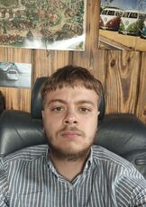

## Ivan Rashragovich



**discord: [@ivanrashragovich](https://discordapp.com/users/833709985744814141/)
tel: +375 33 392 62 44**

******

#### About me:

Ambitious and extroverted person, looking for new opportunities. At the moment I working in import department of large belarusian company supplying truck spare parts from China and EU, but I see my future in IT field. I already tried to express myself in software testing, IT sales, Python developement but I'd always come back to Frontend. Thanks to RS school for giving me huge opportunities for studing and help to finnaly decide whether I wanna connect my life with frontend developement.

Strong points: open-minded, self-motivated, logical thinking, good time-management, trustworthiness.

******

#### Skills: 

Html5, CSS3, advanced level of English (B2+).

******

#### Code examples:

*Return number of decimal Digit*
```
function digits(n) {
  let result = 0;
  let strn = n.toString();
  for (let i = 0; i < strn.length; i+=1) {
    result += 1;
  }
  return result;
}
```
*String ends with ?*
```
function solution(str, ending){
  return (str.endsWith(ending)) ? true : false;
}
```
*Fake Binary*
```
function fakeBin(x){
  let result = ''
  for (let i = 0; i < x.length; i += 1) {
    if (x[i] < 5) {
      result += '0';
    }else {
      result += '1';
    }
  }
  return result;
}
```

******

#### Education: 
Belarus State Economic University

Faculty of international economic relationships, world economy.

******